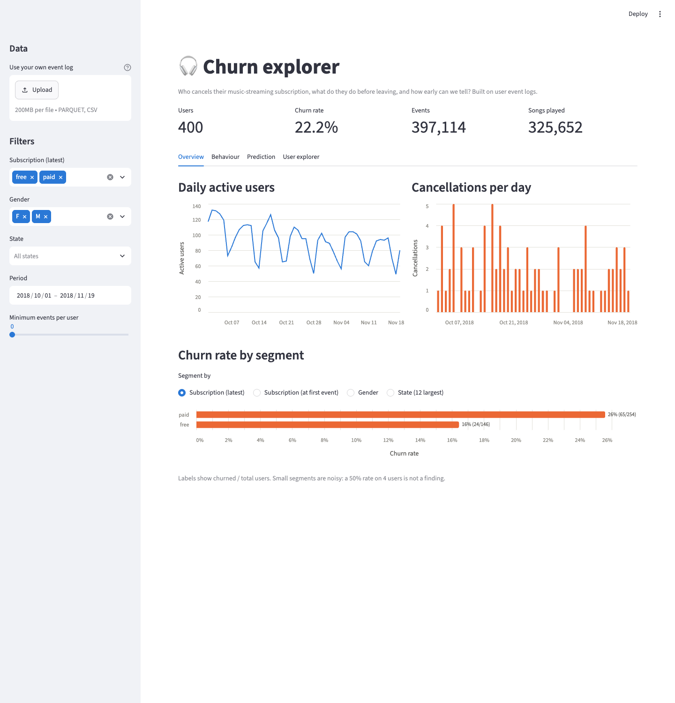
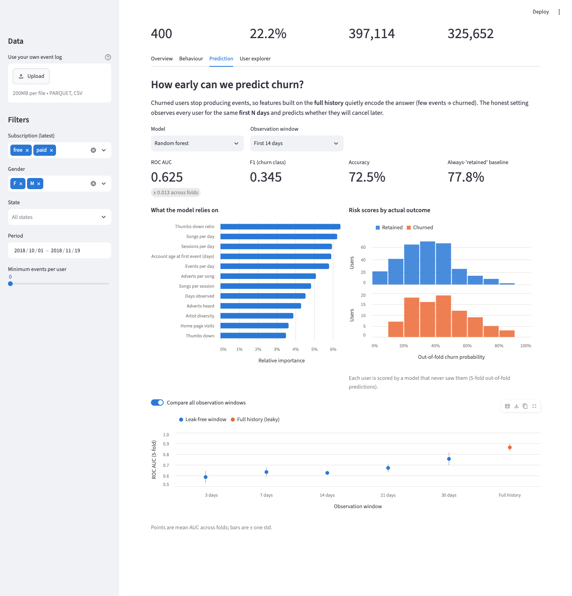

# Churn explorer

[](https://github.com/guustgoossens/sparkify-churn-app/actions/workflows/ci.yml)

A Streamlit app that explores **who cancels a music-streaming subscription, what
they do before leaving, and how early we can tell**, packaged with tests, CI and
a Docker image.

**Live app:** https://pythondskaggle-owncfxclan5u5mycuzbsw4.streamlit.app ·
**Image:** [`rolimups/churn-explorer`](https://hub.docker.com/r/rolimups/churn-explorer)

It is the app version of a churn-prediction Kaggle project done for the *Python
for Data Science* course at École Polytechnique (2025–26) with Litong Hou
([original notebooks and report](https://github.com/guustgoossens/python_ds_kaggle)).
This repository is the individual final project for *Tooling for the Data
Scientist*: the notebooks' logic was rewritten as a small tested package, and the
project's main lesson (temporal leakage) was turned into something you can click
through.



## What the app shows

| Tab | Question it answers |
| --- | --- |
| **Overview** | How active is the user base, when do cancellations happen, which segments churn more? |
| **Behaviour** | Which behaviours differ most between churned and retained users? |
| **Prediction** | How well can a model predict churn from each user's *first N days* only, and how much does the naive "full history" setup overstate that? |
| **User explorer** | What did one specific user do, and what risk did the model give them? |

Sidebar filters (subscription, gender, state, period, minimum activity) apply to
every tab. You can also upload your own event log with the same schema.

### The leakage lesson

Churned users stop producing events, so features computed over the whole log
("number of songs", "days observed") quietly encode the label. On the bundled
sample a random forest reaches **~0.86 ROC AUC on full history but ~0.63 when it
only sees each user's first 14 days**. The second number is the honest one. The
*Compare all observation windows* toggle draws that curve:



Risk scores shown in the app are out-of-fold: every user is scored by a model
that never saw them.

## Quick start

### With Docker

A prebuilt image (linux/amd64 and linux/arm64) is on
[Docker Hub](https://hub.docker.com/r/rolimups/churn-explorer):

```bash
docker run --rm -p 8501:8501 rolimups/churn-explorer:latest
# open http://localhost:8501
```

Or build it yourself:

```bash
docker build -t churn-explorer .
docker run --rm -p 8501:8501 churn-explorer
```

To run on the full dataset instead of the bundled sample, mount it and point the
app at it:

```bash
docker run --rm -p 8501:8501 \
  -v /path/to/train.parquet:/data/train.parquet:ro \
  -e CHURN_DATA_PATH=/data/train.parquet \
  churn-explorer
```

### Locally

Requires [uv](https://docs.astral.sh/uv/) (it installs the right Python for you).

```bash
uv sync --frozen               # exact versions from uv.lock
uv run streamlit run app.py    # http://localhost:8501
```

`make install | run | test | lint | docker-build | docker-run` wrap the same
commands.

## Data

Event logs from a fictional music-streaming service ("Sparkify"-style synthetic
data used for the course's Kaggle competition): one row per user action (play a
song, thumbs up, visit the downgrade page…), 1 Oct – 19 Nov 2018.

The full training file (17.5M events, ~600 MB) is not versioned. The repository
ships **`data/sample_events.parquet`** (5.5 MB): all 397,114 events of 400 users
drawn at random, stratified so the churn rate matches the full data (89 churners,
22%). Name and user-agent columns are dropped. The sample is reproducible:

```bash
uv run python scripts/make_sample.py /path/to/train.parquet --users 400 --seed 42
```

Churn is defined as reaching the `Cancellation Confirmation` page. The `Cancel`
and `Cancellation Confirmation` events are always removed before computing
features.

Expected columns: `userId, sessionId, time, registration, page, level, gender,
location, length, song, artist` (`time`/`registration` as datetimes or epoch
milliseconds). Extra columns are ignored; missing ones produce a clear error in
the app.

## Project layout

```
app.py                     Streamlit UI: widgets, caching, layout. No business logic.
src/churn_app/
  data.py                  load + validate event logs, user profiles, all filters
  features.py              user-level behavioural features (optionally windowed)
  model.py                 cross-validated models, out-of-fold risk scores
  charts.py                Altair chart builders
tests/                     pytest suite (see below)
scripts/make_sample.py     rebuilds the bundled data sample
data/sample_events.parquet bundled sample
Dockerfile                 multi-stage, non-root, healthcheck
.github/workflows/ci.yml   lint → tests → docker build + smoke test (→ optional push)
```

The UI is kept thin on purpose: everything that touches data is a pure function
in `src/churn_app`, so it can be tested without Streamlit.

## Tests

```bash
uv run pytest
```

- **`test_data.py`**: the import and filter functions. Parquet/CSV loading,
  schema validation (missing columns, epoch-ms timestamps, numeric ids, empty or
  user-less rows), state extraction, churn labelling, user/event filters
  including edge cases (empty selection, inclusive end date), the per-user
  observation window, and a guard on the bundled sample itself.
- **`test_features.py`**: features checked against hand-computed values on a
  three-user fixture, plus the invariant that cancellation pages never influence
  any feature.
- **`test_model.py`**: every model evaluates, results are reproducible, bad
  inputs fail with actionable messages.
- **`test_app.py`**: runs the real `app.py` headlessly with Streamlit's
  `AppTest`: default render, filtering, empty filter, missing data file.

Coverage is measured on every run and the suite fails below 90% (currently 100%).

## CI

GitHub Actions runs on every push and pull request:

1. **lint**: `ruff check` and `ruff format --check`
2. **test**: `pytest` with the coverage gate; uploads `coverage.xml`
3. **docker**: builds the image, starts the container and waits for Streamlit's
   health endpoint. If the repository variable `DOCKERHUB_USERNAME` and secret
   `DOCKERHUB_TOKEN` are set, pushes to `main` and `v*` tags also publish a
   multi-arch image to Docker Hub.

## Reproducibility

- Python version pinned in `.python-version` and `pyproject.toml` (3.12).
- Every direct and transitive dependency pinned with hashes in `uv.lock`; CI and
  the Docker build install with `--frozen`, so a stale lock fails rather than
  silently re-resolving.
- Base image, uv version and GitHub Actions are pinned to explicit versions.
- The data sample is generated by a seeded script, and all models and CV splits
  use fixed seeds (a test asserts identical results across runs).
- Optional `pre-commit` hooks run the same ruff checks locally and block
  accidental commits of large data files.

## License

MIT, see [LICENSE](LICENSE).
